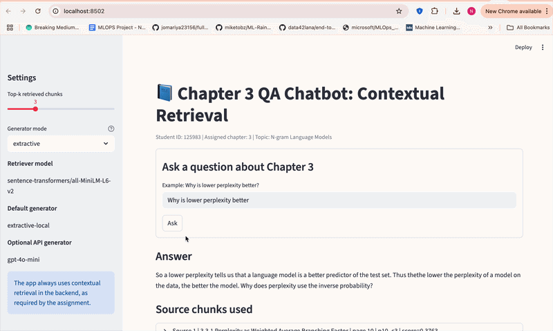

# A6: Naive RAG vs Contextual Retrieval  
**Student ID:** 125983  
**Assigned Chapter:** 3  
**Chapter Title:** *N-gram Language Models*

## 1) Assignment overview
This project implements a domain-specific QA system for **Chapter 3: N-gram Language Models** from the *Speech and Language Processing* textbook.  
It compares two retrieval strategies:

- **Naive RAG**: plain chunking with retrieval over chunk representations
- **Contextual Retrieval**: each chunk is prepended with short contextual information before indexing

The submission includes:

- a Jupyter notebook
- a `README.md`
- an `app/` folder for the chatbot
- an `answer/` folder containing the JSON evaluation file and summary tables
- a `data/` folder containing the Chapter 3 PDF

---

## 2) Source used
- **Book:** Jurafsky & Martin, *Speech and Language Processing* (3rd edition draft)
- **Assigned chapter:** Chapter 3, *N-gram Language Models*
- **Bundled PDF:** `data/chapter3_ngram_language_models.pdf`

---

## 3) Models used
### Retriever
- **Primary retriever:** `sentence-transformers/all-MiniLM-L6-v2`
- **Fallback retriever:** TF-IDF cosine similarity

### Generator
- **Default generator (reproducible / offline):** extractive sentence-ranking answerer
- **Optional API generator:** `gpt-4o-mini` if `OPENAI_API_KEY` is available

> The project is fully runnable without an API key. If `OPENAI_API_KEY` is provided, the system can optionally use `gpt-4o-mini`; otherwise it uses the local extractive generator.

---

## 4) Folder structure
```text
A6_RAG_125983_Chapter3_Project/
├── A6_RAG_125983_Chapter3.ipynb
├── README.md
├── requirements.txt
├── .env.example
├── data/
│   └── chapter3_ngram_language_models.pdf
├── src/
│   └── rag_pipeline.py
├── app/
│   └── app.py
└── answer/
    ├── response-st-125983-chapter-3.json
    ├── response-st125983-chapter-3.json
    ├── rouge_summary.json
    └── evaluation_table.csv
```

---

## 5) How to run the notebook
```bash
pip install -r requirements.txt
jupyter notebook
```

Then open:

```bash
A6_RAG_125983_Chapter3.ipynb
```

---

## 6) How to run the web app
```bash
pip install -r requirements.txt
python -m streamlit run app/app.py
```

The app is fully runnable without an OpenAI API key.

If you want optional LLM-based generation instead of the offline extractive generator, create a `.env` file or export:

```bash
OPENAI_API_KEY=your_key_here
```

Optional for OpenAI-compatible endpoints:

```bash
OPENAI_BASE_URL=your_base_url_here
```

---

## 7) Method summary

### Naive RAG
1. Load Chapter 3 PDF
2. Extract text page by page
3. Split text into overlapping chunks
4. Index the chunks with the retriever
5. Retrieve top-k chunks for each question
6. Generate answers from retrieved chunks

### Contextual Retrieval
1. Use the same base chunks
2. Add a short contextual prefix to each chunk containing:
   - chapter title
   - section name
   - page number
   - a short deterministic summary of the chunk
3. Index the contextualized chunks
4. Retrieve top-k contextual chunks
5. Generate answers from retrieved chunks

In this implementation, the contextual prefix is created programmatically rather than requiring an external LLM. This keeps the system reproducible and runnable offline while still following the Contextual Retrieval idea of prepending extra context before indexing.

---

## 8) Evaluation setup
- **20 QA pairs** were created strictly from Chapter 3.
- Each QA pair contains:
  - `question`
  - `ground_truth_answer`
  - `naive_rag_answer`
  - `contextual_retrieval_answer`
- Evaluation uses **ROUGE-1**, **ROUGE-2**, and **ROUGE-L**.

---

## 9) Final evaluation table

| Method | ROUGE-1 | ROUGE-2 | ROUGE-L |
|---|---:|---:|---:|
| Naive RAG | 0.219 | 0.067 | 0.142 |
| Contextual Retrieval | 0.224 | 0.076 | 0.153 |

### Discussion
Contextual Retrieval performs slightly better than Naive RAG on all three ROUGE metrics. The improvement is smaller than expected, but it is consistent across ROUGE-1, ROUGE-2, and ROUGE-L. This suggests that adding contextual prefixes helps retrieval identify somewhat more relevant chunks, especially when similar terms appear in different parts of the chapter.

At the same time, the relatively modest gap indicates that both systems often retrieve overlapping content from the same chapter. In this project, the main limitation is likely the simple extractive generator, which produces shorter answers with lower lexical overlap than a stronger generative model. Even so, Contextual Retrieval remains the better retrieval strategy overall.

---

## 10) App behavior
The Streamlit chatbot always uses **Contextual Retrieval** in the backend, as required by the assignment.  
For every answer, the app also shows:
- page number
- section title
- chunk id
- similarity score
- retrieved source text

This makes the answer grounded and easy to verify.


---

## 11) Quick conclusion
This project shows that **Contextual Retrieval** improves retrieval quality over a plain Naive RAG baseline for a textbook QA task.  
For this chapter, adding contextual prefixes improves answer overlap with the ground truth and produces more grounded, section-aware responses.
